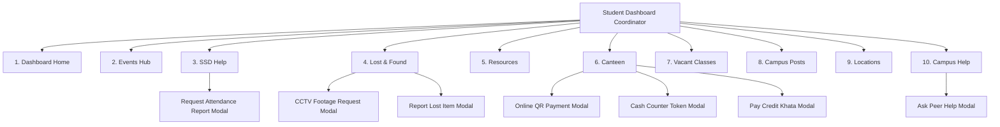

# Campus Student Dashboard — UI & Architecture Documentation

A complete, production-ready Student Portal built with a unified design language, modular component architecture, and structured API integration layers for **Biratnagar International College (BIC)**.

---

## 🏛️ System Overview & Design Aesthetics

* **Visual Identity**: Tailored campus palette featuring deep pine green (`#2f4336`), emerald status accents, amber highlights, clean neutral borders, and subtle elevation cards.
* **Responsive Layout**: Sticky top navigation bar, collapsable persistent sidebar, and fluid main content area.
* **Theme Support**: Seamless automatic switching between Light and Dark themes via `ThemeContext`.
* **Real-time UX**: Dynamic greetings (`Good Morning`, `Good Afternoon`, `Good Evening`), live calendar pills, interactive loading toasts, and simulated async approvals (Bimala Mam 5s approval, Canteen Owner 3s approval).

---

## 🧭 Navigation & Section Workflow



---

## 📱 Detailed Section Breakdown

### 1. Main Dashboard (`DashboardHome.jsx`)
* **Dynamic Local Greeting**: `"Good [Morning/Afternoon/Evening], [Student Name] 👋"` reflecting student local time.
* **Attendance Overview Card**: Displays **87% Overall Attendance** with interactive link to SSD Attendance.
* **Upcoming Events Card**: Highlights closest tech conference/fest (*Devfest Program*).
* **Today Canteen Special**: 3-item list with **Diya Ko Royal Biryani** (NPR 220) highlighted in bold amber badge.
* **Vacant Classroom Live Card**: Real-time room selector with **Shuffle** button and permission grant CTA.
* **Important Announcements**: Urgent deadline tags and notice alerts with view-all modal.
* **Lost & Found Highlights**: Recent campus lost items with quick report button.
* **Help Directory Summary Strip**: Quick contact cards for BIC Front Desk, SSD Helpline, and Address.

---

### 2. Campus Events Hub (`EventsSection.jsx`)
* **Filter Pills**: Seamless switching between `All Events`, `College Events`, and `Community Events`.
* **College Events**: Official ceremonies (*Devfest Program*, *FUTURMA Robotics*, *Dashain Carnival*) with time, venue, and registration status.
* **Community Events**: Student-led workshops (*AI Horizon Workshop*, *Coding Sprint*, *UI/UX Design Jam*) with organization tags and "Join" actions.

---

### 3. Student Services Department (`SSDHelpSection.jsx`)
* **Sub-Navigation Tabs**:
  1. **Attendance Tracker**:
     - **87% Overall Attendance** KPI Card (Above 75% target).
     - **42 Present Days** vs **6 Absent Days**.
     - **Daily Attendance Check-in**: One-click verified check-in logger.
     - **Request Attendance Report**: Prominent banner opening a certified PDF request modal.
     - **Activity Log**: Detailed history with dates, timestamps, room IDs, and status pills.
  2. **Volunteering History**:
     - Verified community service log (*36 Total Hours Completed*).
     - Role badges: *Freshers Induction Mentor (12h)*, *Blood Donation Coordinator (8h)*, *TechFest Logistics (16h)*.
  3. **Upcoming Events / Volunteer Requests**:
     - Active campus recruitment callouts (*XPERIA 2026 Logistics*, *Sports Week Referee*, *Health Drive*).
     - Interactive **"Sign Up to Volunteer"** application workflow.

---

### 4. Lost & Found Portal (`LostFoundSection.jsx`)
* **CCTV Footage Verification Request**:
  - Direct request to Campus Security with camera zone selection (*Library 2nd Floor, Cafeteria, Block A Stairs, Labs*), incident date, time range (`timeFrom` to `timeTo`), and reason.
  - Active request tracking cards with `In Review` badge.
* **Misplaced Items Catalog**: Filterable card grid with location tags, timestamps, and one-click "Claim this Item" action.
* **Report Lost Item Modal**: Quick form for students reporting missing personal items.

---

### 5. Campus Resources & Services (`ResourcesSection.jsx`)
Features a prominent **one-row horizontal navigation bar** with 4 specialized categories:

1. **📚 1. Library Books System**:
   - Real-time searchable book catalog with shelf numbers.
   - **Bimala Mam (Library In-Charge) 5-Second Approval Workflow**:
     - *Borrowing*: Submits request $\rightarrow$ 5s loading spinner $\rightarrow$ Approved by Bimala Mam $\rightarrow$ Book issued for 14 days.
     - *Returning*: Returns to counter $\rightarrow$ 5s condition verification $\rightarrow$ Accepted by Bimala Mam $\rightarrow$ Record cleared.
2. **🏆 2. Sports Items Needed**:
   - Requisition form for *Cricket Bat*, *Football*, *Basketball*, *Table Tennis*, *Chess*, *Ludo*.
   - Slot selection (*Lunch Break*, *Sports Hour*, *Inter-Department Match*).
   - Requisition tracker with desk pickup status.
3. **💼 3. Budget Claim & Others**:
   - Club/event budget reimbursement claims (*Title*, *Amount*, *Receipt notes*).
   - Special equipment booking (*Portable PA Sound System*, *Extension cords*, *Streaming camera*).
4. **🔧 4. Facility Complaints**:
   - Direct maintenance ticket dispatch (*Breakage of Door*, *Bench Management*, *AC Problem*, *Projector Issue*, *Water Leakage*).
   - Urgency levels (*Low*, *Medium*, *High*) and live maintenance status tracker.

---

### 6. Campus Canteen & Ordering (`CanteenSection.jsx`)
* **Menu Grid**: 12 fresh campus items with pricing and category tags (*Diya Ko Royal Biryani, Momo, Chowmein, Chatpatey, Aalu Nimki, Lassi, etc.*).
* **Live Food Cart**: Quantity adjusters (`+` / `-`), subtotal calculator, and **Extra Preferences** textarea.
* **3 Payment Methods**:
  1. 💵 **Cash**: Generates counter pickup token number (e.g. `#482`).
  2. 📱 **Online (QR)**: Displays official Machhapuchchhre Bank / Fonepay QR code modal.
  3. 💳 **Credit Khata**: Adds amount to pending **Credit Due** balance.
* **Pay Credit Due (Khata)**:
  - Header credit due badge appears only inside Canteen view.
  - **3-Second Canteen Owner Approval**: Paying cash triggers 3-sec loading state before owner verifies and resets Credit Due to NPR 0.

---

### 7. Vacant Classrooms (`VacantClassesSection.jsx`)
* Real-time classroom availability cards (*SR01 Wolves, SR02 Compton, Mechi, Kankai, Baraha, LT01 Wulfurana*).
* Displays floor, capacity, amenities (*Projector, AC, Smart Screen*), and live permission toggle (`Vacant` $\rightarrow$ `Pending` $\rightarrow$ `Approved`).

---

### 8. Campus Social Posts (`CampusPostsSection.jsx`)
* High-definition media feed displaying real campus social media posts & reels (`post-1.png` to `post-4.png`).
* Verified department badges, interactive like counter with heart animations, comments, and share actions.

---

### 9. Campus Locations & Guide (`LocationSection.jsx`)
* Official campus address: **Biratnagar 5, Bhrikuti Chowk, Morang, Koshi Province, Nepal**.
* One-click Google Maps launcher.
* Comprehensive block directory:
  - **Block A**: Admissions, Administration, Room 102 (SSD), SR01 Wolves, SR02 Compton.
  - **Block B**: Computer Labs 1–3, AI Robotics Lab, Mechi, Kankai.
  - **Block C & Central**: Central Library, Cafeteria, LT01 Wulfurana Auditorium, Sports Desk.

---

### 10. Campus Help & Contact Directory (`CampusHelpSection.jsx`)
* **Official BIC & ING Logo**: Rendered prominently at the top of the support page (`/bic-logo-full.png`).
* **Official BIC Contact**:
  - 📞 **PHONE**: `021-500050 / 021-500170 / 9801009090`
  - ✉️ **EMAIL**: [`info@bicnepal.edu.np`](mailto:info@bicnepal.edu.np)
  - 📍 **LOCATION**: `Biratnagar 5, Bhrikuti Chowk`
* **Student Services Department (SSD) Contact**:
  - 📞 **SSD Helpline**: `+977 9802747227`
  - ✉️ **SSD Email**: [`studentservices@bicnepal.edu.np`](mailto:studentservices@bicnepal.edu.np)
  - 🏢 **Office**: Block A, Room 102 (07:00 AM – 04:00 PM)
* **Campus Peer Help Desk**: Student Q&A forum with `+ Ask Help` modal and reply actions.

---

## 🏗️ Codebase File Structure

```text
client/
├── public/
│   ├── bic-logo-full.png        # Official BIC | ing Skill Logo
│   ├── canteen-qr.jpg           # Machhapuchchhre Bank Fonepay QR
│   ├── post-1.png to post-4.png # Campus Social Posts Media
│
├── src/
│   ├── api/                     # Modular API Service Layer
│   │   ├── axiosInstance.js     # Configured Axios with JWT interceptors
│   │   ├── eventsApi.js         # College & Community Events endpoints
│   │   ├── ssdHelpApi.js        # Attendance, Reports & Volunteering endpoints
│   │   ├── lostFoundApi.js      # Items & CCTV requests endpoints
│   │   ├── resourcesApi.js      # Library, Sports, Budget & Maintenance endpoints
│   │   ├── canteenApi.js        # Menu, Orders & Credit Khata endpoints
│   │   ├── vacantClassesApi.js  # Classrooms & Permissions endpoints
│   │   ├── campusPostsApi.js    # Social posts & likes endpoints
│   │   └── campusHelpApi.js     # Peer questions & support endpoints
│   │
│   ├── data/
│   │   ├── navConfig.js             # Sidebar route sequence
│   │   ├── themes.js                # Color themes (light / dark)
│   │   └── studentDashboardData.js  # Constants & Initial Fallback Data
│   │
│   ├── components/
│   │   └── student/                 # Self-Contained Section Modules
│   │       ├── DashboardHome.jsx
│   │       ├── EventsSection.jsx
│   │       ├── SSDHelpSection.jsx
│   │       ├── LostFoundSection.jsx
│   │       ├── ResourcesSection.jsx
│   │       ├── CanteenSection.jsx
│   │       ├── VacantClassesSection.jsx
│   │       ├── CampusPostsSection.jsx
│   │       ├── LocationSection.jsx
│   │       ├── CampusHelpSection.jsx
│   │       │
│   │       └── modals/              # Modular Dialog Components
│   │           ├── RequestAttendanceReportModal.jsx
│   │           ├── CctvRequestModal.jsx
│   │           ├── OnlineQrModal.jsx
│   │           ├── CashTokenModal.jsx
│   │           ├── ReportLostItemModal.jsx
│   │           ├── AskHelpModal.jsx
│   │           ├── PayCreditModal.jsx
│   │           └── AnnouncementsModal.jsx
│   │
│   └── pages/
│       └── StudentDashBoard.jsx     # Clean Coordinator Page
```

---

## 🚀 Backend Integration Ready

Every section is equipped with async API service bindings located in `client/src/api/`. When backend REST endpoints are deployed, no UI rewrite is required: the endpoints will automatically communicate with Express / MongoDB controllers through `axiosInstance`.
